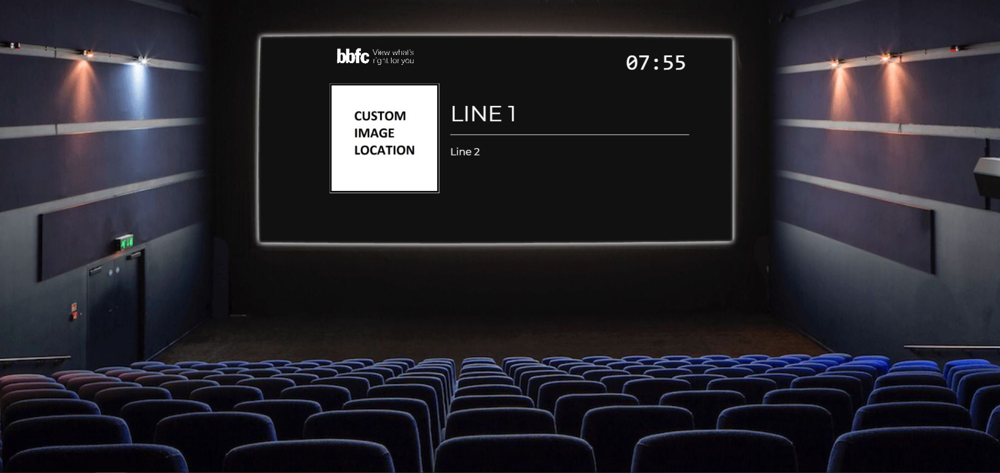

# presentation-timer

[](https://snyk.io/test/github/ripixel/presentation-timer?targetFile=package.json) 

A simple presentation countdown timer with music streaming for use on streams/presentations.

## Functionality

Allows you to create a countdown timer configured with:

- Target Time
- Two lines of text
- A "playlist" of video URLs to play automatically
- A custom image displayed on the timer
- A pop-out control window to change values without affecting the presentation window


All of this happens client-side - nothing is ever sent to any backend server - so no account required!

## Usage

Go to [https://pt.ripixel.co.uk/](https://pt.ripixel.co.uk/), and configure your timer as instructed.

When you hit the button, you will see your presentation timer has begun, and another config window has popped open to allow you to amend it while running, without disturbing the presenting window.

That's it!

## Why?

When doing presentations, it's nice to have a countdown to the start at the beginning, and it's even nicer to have some music playing in the background. However, combining these two things usually means a lot of messing around with audio inputs/outputs, or you just resort to playing the music out your speakers and detecting it with your microphone, or capturing your entire machine's audio.

Having the presentation countdown **and** the music playing in the same tab means most streaming tools can pick up the audio in a nice way.

## Themes

### Macbook


### Cinema



## Running locally

### Development

Run `npm ci` to install dependencies, then `npm run dev` to boot up a local server.

### Tests

Run `npm run test` to run the tests - this codebase isn't currently covered fantastically, but that will improve soon, at which point coverage thresholds will be turned on and required to pass.

## Contributing

There's no formal contribution method, but pull requests are always welcome - especially if you want to create a theme!

### Creating a Theme

To create a theme, take a look at the existing examples in the `src/Components/Themes` directory.

The only requirements are that you use the `getDrawingInfo` helper function, and use the values it supplies to write your `draw` and `updateDraw` methods:

- `draw` is called once at the beginning of the timer - so do your heavy background-setting there.
- `updateDraw` is called every second (or there abouts) to draw any updates, usually to the countdown, and if either of the line values have changed - make this as lightweight as possible.

For both functions, when you're done call the passed-in `setCanvasData()` function to submit your changes to the page.

**Note:** You must use the values supplied by the helper function from _within_ your `*draw` functions to ensure if the config is changed while the presentation is active, the draw functions use the updated values rather than the values when they were initialised

Finally, ensure your Theme component returns a `<Timer />` component, passing your `draw` and `updateDraw` functions, as well as the canvas size defined:

```typescript
<Timer
  draw={draw}
  updateDraw={updateDraw}
  width={IMG_WIDTH}
  height={IMG_HEIGHT}
/>
```

Create your new Theme component inside `src/Components/Themes`, modify the `THEMES` enum inside of `src/services/config` with your new theme. and finally modify the `switch` inside `src/components/ConfigProcessor` to handle your new theme.

Any assets your theme uses should go in `public/assets`, and similarly if your theme requires new fonts the HTML is available in `public`.
