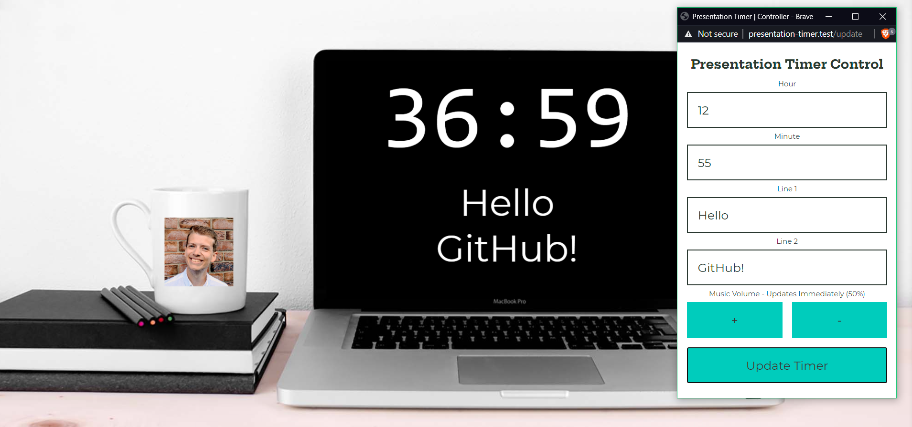
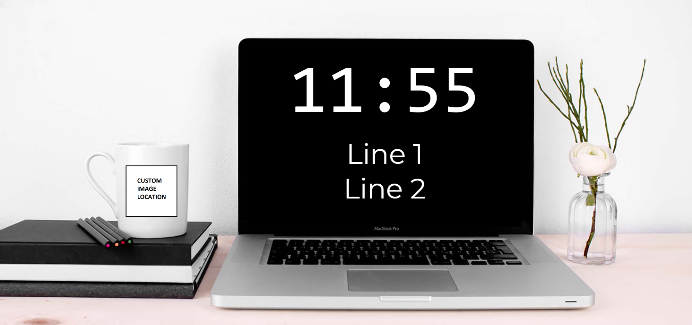

# presentation-timer

 

A simple presentation countdown timer with music streaming for use on streams/presentations.

## Functionality

Allows you to create a countdown timer configured with:

- Target Time
- Two lines of text
- A "playlist" of video URLs to play automatically
- A custom image displayed on the timer
- A pop-out control window to change values without affecting the presentation window

All of this happens client-side - nothing is ever sent to any backend server - so no account required!

## Usage

Go to [https://pt.ripixel.co.uk/](https://pt.ripixel.co.uk/), and configure your timer as instructed.

When you hit the button, you will see your presentation timer has begun, and another config window has popped open to allow you to amend it while running, without disturbing the presenting window.

That's it!

## Why?

When doing presentations, it's nice to have a countdown to the start at the beginning, and it's even nicer to have some music playing in the background. However, combining these two things usually means a lot of messing around with audio inputs/outputs, or you just resort to playing the music out your speakers and detecting it with your microphone, or capturing your entire machine's audio.

Having the presentation countdown **and** the music playing in the same tab means most streaming tools can pick up the audio in a nice way.

## Themes

### Macbook

## Running locally

Run `npm ci` to install dependencies, then `npm run dev` to boot up a local server.
